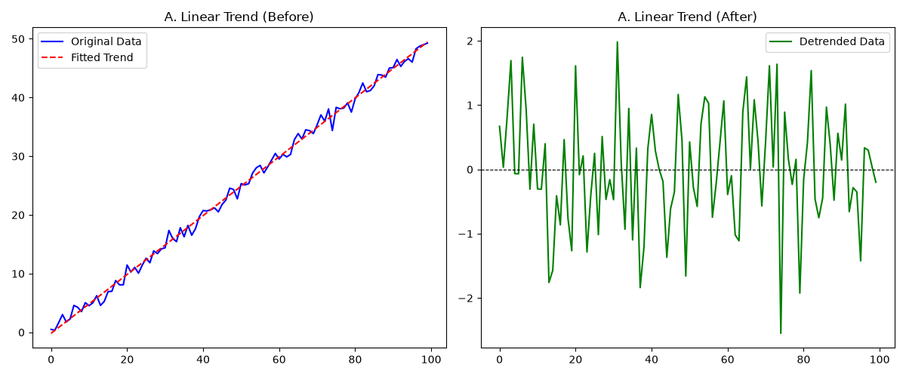
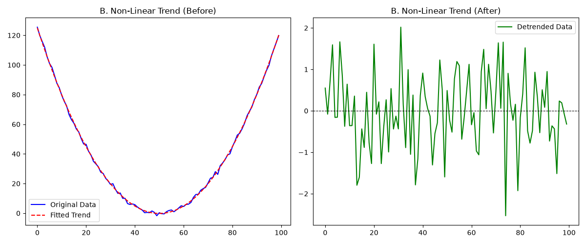
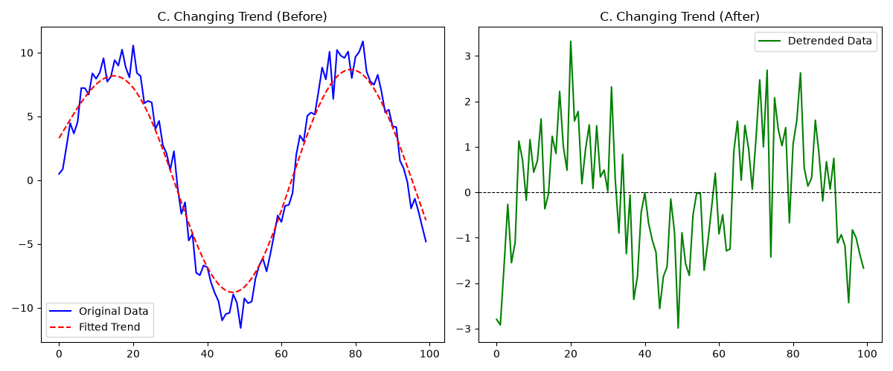
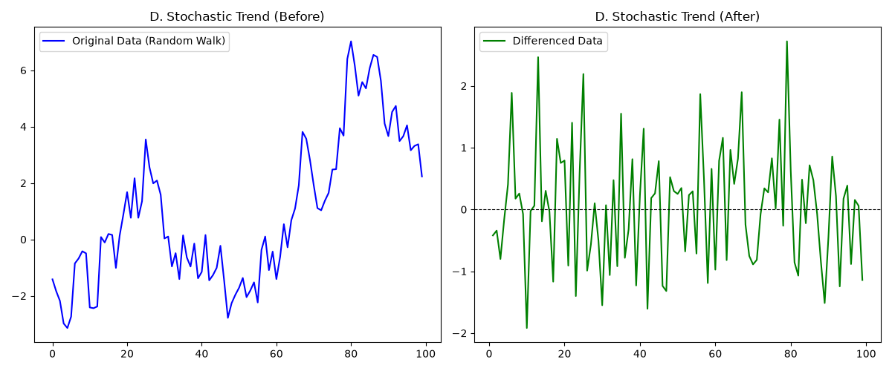

# 2. The Trend ($T_t$)

## Detrending

### Step 1: The Visual Test (Plot & Inspect)
Generate a simple line plot of your raw data. Look closely at the overall long-term direction, ignoring the short-term seasonal wiggles. Your trend will almost always fall into one of these four visual categories:

#### A. Linear Trend
- **What it looks like**: The data climbs or falls steadily in a straight line over time.
- **The Math**: $T_t = \beta_0 + \beta_1 t$
- **Best Detrending Tool**: Linear Regression. Fit a straight line to the data and subtract it.

#### B. Non-Linear / Polynomial Trend
- **What it looks like**: The data curves. It might start slow and accelerate upward (exponential), or rise and then plateau (logarithmic).
- **The Math**: $T_t = \beta_0 + \beta_1 t + \beta_2 t^2 + \dots$
- **Best Detrending Tool**: Polynomial Regression. Fit a curve by choosing the appropriate degree (order) based on the number of turns in the graph.

#### C. Changing / Non-Parametric Trend
- **What it looks like**: The trend is smooth but erratic—it goes up for two years, flattens out, dips, and then goes up again. A single global equation cannot capture it.
- **Best Detrending Tool**: Moving Averages or STL / HP Filters. These tools calculate a rolling baseline that bends dynamically with the data.

#### D. Stochastic Trend (Random Walk)
- **What it looks like**: Highly erratic day-to-day or step-by-step drift with no stable long-term shape (very common in stock prices).
- **The Math**: $Y_t = Y_{t-1} + \epsilon_t$
- **Best Detrending Tool**: Differencing. Do not try to fit a trend line. Instead, subtract yesterday's value from today's value ($Y_t - Y_{t-1}$).

### Step 2: Statistical Verification (The KPSS Test)
If you aren't sure whether your visual guess is correct, you can back it up with a statistical test. The KPSS (Kwiatkowski-Phillips-Schmidt-Shin) test is specifically designed for this.

The KPSS test checks two different hypotheses:
1. Is the data stationary around a constant mean? (No trend exists).
2. Is the data stationary around a linear trend? (A predictable linear trend exists).

By running this test in Python (`statsmodels.tsa.stattools.kpss`), the output $p$-value will tell you definitively whether a deterministic trend exists or if you are dealing with a random stochastic drift that requires differencing.

#### Deep Dive: KPSS (Kwiatkowski-Phillips-Schmidt-Shin) Test

The KPSS (Kwiatkowski-Phillips-Schmidt-Shin) test is a statistical test used to determine whether a time series is stationary or if it contains a trend. Unlike most other stationarity tests (like the Augmented Dickey-Fuller / ADF test), the KPSS test turns the logic upside down:

- **Null Hypothesis ($H_0$)**: The time series is stationary (either around a constant mean or around a deterministic trend).
- **Alternative Hypothesis ($H_1$)**: The time series is not stationary (it has a unit root / stochastic random trend).

Therefore, a low p-value (typically $< 0.05$) means you reject the null hypothesis, concluding that your data is not stationary and still has a random trend that needs to be fixed (usually by differencing).

##### Step-by-Step Breakdown of the KPSS Equation

The KPSS test works by breaking down your time series into three parts: a deterministic trend, a random walk, and stationary error.

###### Step 1: The Structural Model
The test assumes the observed time series $Y_t$ can be written as:
$$Y_t = \xi t + r_t + \varepsilon_t$$
Where:
- $\xi t$ is a deterministic trend (a straight line over time $t$).
- $\varepsilon_t$ is a stationary error term (white noise).
- $r_t$ is a random walk component, defined as:
$$r_t = r_{t-1} + u_t$$
(Here, $u_t$ is pure random noise with a mean of 0 and a variance of $\sigma_u^2$).

The core logic: If the variance of that random walk component ($\sigma_u^2$) is exactly zero, then $r_t$ becomes a constant baseline, meaning the random walk disappears. If the random walk disappears, the series is stationary!

Therefore, the test fundamentally tests: $H_0: \sigma_u^2 = 0$.

###### Step 2: Calculate the Residuals ($e_t$)
To isolate the random walk and noise, we first remove the deterministic parts. We run a linear regression of $Y_t$ against a constant (and a time trend $t$, if testing for trend-stationarity) to get the estimated residuals:
$$e_t = Y_t - \hat{Y}_t$$

###### Step 3: Compute the Cumulative Sum of Residuals ($S_t$)
Next, we track how the errors accumulate over time. We calculate the cumulative sum of the residuals from the very first time step up to time $t$:
$$S_t = \sum_{i=1}^{t} e_i$$
If the data is stationary, the residuals will randomly bounce above and below zero, meaning they will constantly cancel each other out, and $S_t$ will stay relatively small. If there is a random drift, $S_t$ will grow larger and larger.

###### Step 4: Calculate the Long-Run Variance ($s^2(l)$)
Because time series data points are often correlated with the points right next to them (autocorrelation), we can't just use standard variance. We must calculate a consistent estimator of the long-run variance of the residuals, which uses a look-back window (bandwidth $l$):
$$s^2(l) = \frac{1}{T} \sum_{t=1}^{T} e_t^2 + \frac{2}{T} \sum_{s=1}^{l} w(s, l) \sum_{t=s+1}^{T} e_t e_{t-s}$$
- $T$ is the total number of observations.
- $w(s, l)$ is a weighting function (usually a Newey-West Bartlett kernel) that gives less weight to points that are further apart in time.

###### Step 5: Calculate the KPSS Test Statistic ($LM$)
Finally, we plug our cumulative sums ($S_t$) and our long-run variance ($s^2(l)$) into the Lagrange Multiplier ($LM$) statistic formula:
$$LM = \frac{\sum_{t=1}^{T} S_t^2}{T^2 \cdot s^2(l)}$$

##### How to Interpret the Result
Once you calculate the $LM$ statistic, you compare it to a table of critical values established by the creators of the test:
- If your calculated $LM$ statistic is larger than the critical value, you reject $H_0$. Your data is not stationary (it has a random trend).
- If your calculated $LM$ statistic is smaller than the critical value, you fail to reject $H_0$. Your data is stationary.

##### Deep Dive: Random Walk vs. Stationary Error

It is incredibly common to mix these two up because they are both built out of random noise, but they are fundamentally different in how they behave over time. The easiest way to understand the difference is to look at memory. A stationary error has no memory of the past, while a random walk remembers everything that ever happened to it.

Here is the breakdown of why they are not the same:

###### 1. Stationary Error ($\varepsilon_t$)

A stationary error term (often called white noise) represents pure, short-term randomness.
- **The Math**: It is just a sequence of independent random numbers drawn from a distribution with a mean of 0 and a constant variance ($\sigma^2$).
- **Memory**: It has zero memory. What happens at time step $t$ has absolutely no connection to what happened at time step $t-1$.
- **Behavior**: It represents temporary shocks. If a giant storm hits your bakery today and drops sales, tomorrow's sales are completely unaffected by yesterday's storm. The data immediately snaps back to its baseline.

###### 2. Random Walk Component ($r_t$)

A random walk is built by accumulating (summing up) random shocks over time.
- **The Math**: 
$$r_t = r_{t-1} + u_t$$
(Where $u_t$ is a stationary error shock).
- **Memory**: It has infinite memory. Because $r_{t-1}$ is embedded inside $r_t$, today's value is equal to the sum of every single random shock that has ever occurred since the beginning of time ($r_t = u_1 + u_2 + \dots + u_t$).
- **Behavior**: It represents permanent shocks. If a competitor opens up next door today ($u_t$), that shock doesn't vanish tomorrow; it alters your baseline permanently moving forward.

###### Visual Comparison: Shocks vs. Accumulation

Imagine you are flipping a coin: Heads = +1, Tails = -1.
- **Stationary Error ($\varepsilon_t$)**: You look only at the result of the current flip. The result is always either +1 or -1. It never grows, it never trends, and it always bounces around 0.
- **Random Walk ($r_t$)**: You keep a running total of your score. If you flip 5 heads in a row, your score is +5. To get back to 0, you need to flip 5 tails. Your score can drift incredibly far away from 0 and stay there for a very long time.

###### Why This Matters for the KPSS Test

In the KPSS equation ($Y_t = \xi t + r_t + \varepsilon_t$):
- $\varepsilon_t$ is the benign, short-term noise that we expect in any real-world data. It doesn't break stationarity.
- $r_t$ is the dangerous, unpredictable wandering component.

If the variance of the shocks driving the random walk ($\sigma_u^2$) is greater than zero, the random walk grows, the series drifts randomly, and the data becomes non-stationary. If $\sigma_u^2 = 0$, the random walk turns off completely, leaving only the stationary error.

### Step 3: Verify Your Success (The "After" Plot)
The ultimate way to know if you identified the trend accurately is to look at the residuals (the detrended data).

Once you subtract your calculated trend, plot the result. It is accurately detrended if it passes these two checks:
- **The Zero-Mean Check**: The graph must look completely horizontal, bouncing symmetrically above and below zero. If it still tilts or curves, your trend model was too simple (underfitted).
- **The Noise Check**: The remaining data should look like a combination of predictable seasonal waves and purely random noise.
