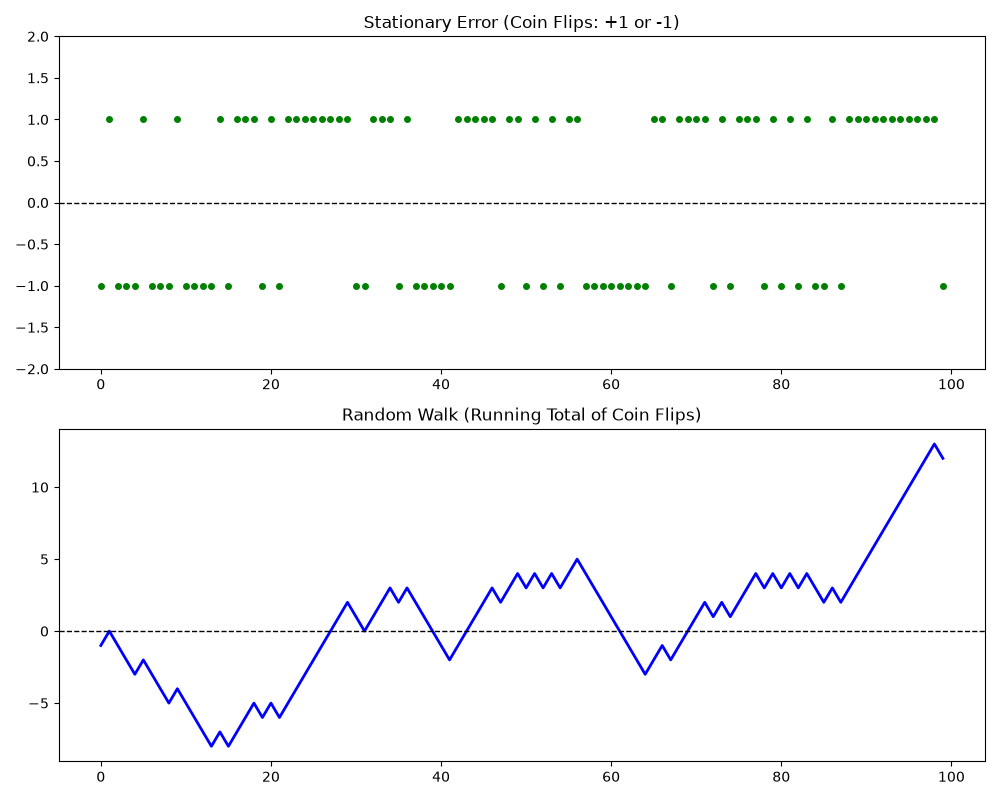

# Stationary Error

In a time series decomposition ($Y_t = T_t + S_t + I_t$), the stationary error ($I_t$ or $\varepsilon_t$) is the ultimate destination. It is the purely random, unpredictable baseline that remains after you have successfully stripped away all patterns like trends and seasonality.

Here is a deep dive into how stationary error behaves, its mathematical foundations, and how to identify it visually.

## 1. The Mathematical Definition

For an error term to be truly stationary, it must satisfy three strict mathematical conditions over time:

- **Constant Mean**: The expected value (average) of the error must be constant over time, and it is almost always centered exactly at zero.
  $$E(\varepsilon_t) = 0$$
- **Constant Variance**: The spread or volatility of the errors cannot change. The thickness of the data band must look the same at the beginning of the series as it does at the end.
  $$Var(\varepsilon_t) = \sigma^2$$
- **No Autocorrelation (Independence)**: The error at time $t$ must have absolutely zero correlation with the error at any previous time step ($t-k$). What happens today tells you nothing about what will happen tomorrow.
  $$Cov(\varepsilon_t, \varepsilon_{t-k}) = 0 \quad \text{for all } k \neq 0$$

> [!NOTE]
> When a stationary error meets these criteria perfectly, it is mathematically defined as **White Noise**.

## 2. The Equation Example

Let's look at how a stationary error is generated step-by-step. Imagine a time series that is only made up of a constant baseline of $\$100$ plus stationary error:

$$Y_t = 100 + \varepsilon_t$$

Where $\varepsilon_t \sim N(0, 25)$ (meaning the error is randomly drawn from a normal distribution with a mean of 0 and a variance of 25, meaning a standard deviation of 5).

**Generating Data Points:**
- **At $t=1$**: We draw a random number from our distribution. Let's say $\varepsilon_1 = +4$.
  $$Y_1 = 100 + 4 = 104$$
- **At $t=2$**: We draw another completely independent random number. Let's say $\varepsilon_2 = -6$.
  $$Y_2 = 100 - 6 = 94$$
- **At $t=3$**: We draw another random number. Let's say $\varepsilon_3 = +1$.
  $$Y_3 = 100 + 1 = 101$$

> [!TIP]
> Notice that the error from $t=1$ ($+4$) has no memory or lingering effect on $t=2$. The series completely resets its random bounce at every single step.

## 3. Visualizing Stationary Error

If you plot a purely stationary error series on a graph, it has a highly distinct "look" that separates it from any other time series component.

### The Three Visual Tests:
1. **The Horizontal Baseline**: The data should constantly cross and oscillate around a horizontal line (usually zero). If the data starts drifting up or down, it is no longer a stationary error—it has a lingering trend.
2. **The Constant "Bandwidth"**: If you draw a boundary line across the top peaks and another across the bottom valleys, those two lines should be perfectly parallel. If the valleys and peaks expand over time (forming a megaphone shape), the variance is changing, meaning it is non-stationary.
3. **The Autocorrelation Function (ACF) Plot**: To visually check for independence, data scientists use an ACF plot, which measures how correlated a data point is with its past selves. For a stationary error, the plot should show a massive spike at lag 0 (since a point is 100% correlated with itself), and absolutely nothing at any other lag (for more details, see [Deep Dive: Autocorrelation Function (ACF)](4_acf.md)).

## Why Data Scientists Obsess Over Stationary Error

When you are building a forecasting model, your goal is to extract every single ounce of predictable information out of the data.

> [!IMPORTANT]
> If you decompose your time series and run a KPSS test on your residuals, and the test says, "Yes, these residuals are stationary error," it means your job is done. You have extracted all possible patterns (trends, seasons, cycles). What is left is pure, unmodeled physical randomness.
>
> If the residuals are not stationary error, it means you left valuable patterns on the table, and your forecasting model will likely perform poorly.

---

# Random Walk

A Random Walk is a classic non-stationary time series process where the current value of a variable is determined by its immediately preceding value plus a random, unpredictable shock.

In data science and finance, it is famously used to describe things like stock market prices, the diffusion of molecules in a fluid (Brownian motion), or the path of a gambler's bankroll. Its core characteristic is **infinite memory**—every single shock that hits the system alters its baseline permanently.

Here is the detailed mathematical breakdown of how a random walk works.

## 1. The Core Equation (The Baseline Model)

The standard mathematical formula for a pure random walk is:
$$Y_t = Y_{t-1} + \varepsilon_t$$

Where:
- $Y_t$ is the value of the time series at the current time step $t$.
- $Y_{t-1}$ is the value of the time series at the previous time step.
- $\varepsilon_t$ is the stationary error (white noise) at time $t$, meaning $\varepsilon_t \sim N(0, \sigma^2)$.

**The Hidden Coefficient (The Unit Root)**
Notice that $Y_{t-1}$ is implicitly multiplied by $1.0$. In time series literature, this is known as a **unit root**. Because this coefficient is exactly $1$, the system carries over $100\%$ of its past state into the future. There is no decay, damping, or mean-reversion.

## 2. Expanding the Equation (The Infinite Memory Proof)

To see why a random walk behaves the way it does, we can recursively expand the equation backward in time all the way to its starting value ($Y_0$):
- **At $t = 1$**:  $Y_1 = Y_0 + \varepsilon_1$
- **At $t = 2$**:  $Y_2 = Y_1 + \varepsilon_2 = (Y_0 + \varepsilon_1) + \varepsilon_2$
- **At $t = 3$**:  $Y_3 = Y_2 + \varepsilon_3 = (Y_0 + \varepsilon_1 + \varepsilon_2) + \varepsilon_3$

If we continue this pattern up to any general time step $t$, the equation becomes:
$$Y_t = Y_0 + \sum_{i=1}^{t} \varepsilon_i$$

> [!NOTE]
> **The Takeaway:**
> The value of a random walk today ($Y_t$) is literally the starting value ($Y_0$) plus the cumulative sum of every single random shock ($\varepsilon$) that has occurred since the beginning of time.
> 
> If a positive shock happens at $t=2$, that positive value is locked into the foundation and carried forward into $Y_3, Y_4, \dots$ forever.

## 3. Statistical Properties (Why it is Non-Stationary)

For a time series to be stationary, its mean and variance must remain constant over time. Let's see how a random walk breaks these rules using the expanded equation.

### The Mean
Assuming the starting point $Y_0 = 0$, the expected value (mean) of a random walk is:
$$E(Y_t) = E\left(\sum_{i=1}^{t} \varepsilon_i\right) = \sum_{i=1}^{t} E(\varepsilon_i) = 0$$
The theoretical mean remains constant at $0$.

### The Variance (The Structural Break)
Because each shock $\varepsilon_i$ is completely independent, the variance of the sum is equal to the sum of the variances:
$$Var(Y_t) = Var\left(Y_0 + \sum_{i=1}^{t} \varepsilon_i\right) = \sum_{i=1}^{t} Var(\varepsilon_i)$$

Since each individual shock has a constant variance of $\sigma^2$:
$$Var(Y_t) = t \cdot \sigma^2$$

> [!WARNING]
> Look closely at that result: **The variance depends on time ($t$)**. As time goes forward, the variance scales linearly with $t$, exploding toward infinity. This is why a random walk is non-stationary: the envelope of where the data could wander expands wider and wider the further into the future you go.

## 4. Side-by-Side Comparison

### The Comparison Matrix

| Feature | Stationary Error (White Noise) | Random Walk |
| :--- | :--- | :--- |
| **Core Equation** | $Y_t = \varepsilon_t$ | $Y_t = Y_{t-1} + \varepsilon_t$ |
| **Expanded Structure** | $Y_t = \varepsilon_t$ | $Y_t = Y_0 + \sum_{i=1}^{t} \varepsilon_i$ |
| **Memory** | Zero Memory (Every step resets completely). | Infinite Memory (Accumulates every historical shock). |
| **Mean over Time ($E(Y_t)$)** | Constant (Usually centered at $0$). | Constant ($Y_0$, assuming no drift). |
| **Variance over Time ($Var(Y_t)$)** | Constant ($\sigma^2$) | Explodes with time ($t \cdot \sigma^2$) |
| **Stationarity** | Strictly Stationary | Non-Stationary |
| **Behavior After a Shock** | Immediately snaps back to the baseline. | Permanently changes its baseline. |
| **How to Remove It** | You don't. This is your target clean noise. | Differencing ($Y_t - Y_{t-1}$) |

### 1. Deep Dive into Behavior After a Shock

The most practical way to distinguish the two is to observe how they respond to a single, sudden random event (a "shock," like $\varepsilon_t = +10$).

- **Stationary Error Response**: Because there is no connection to the past, a shock is a one-time event. If a massive storm hits a business today, sales drop today. Tomorrow, the storm is gone, the data completely forgets about it, and sales instantly bounce right back to the long-term average.
- **Random Walk Response**: Because today's baseline is built directly on top of yesterday's value, a shock is permanent. If a competitor opens next door today, it alters your baseline revenue. That negative shock is carried forward into tomorrow's calculation, and the day after that, altering the trajectory of the series forever.

### 2. Visual Comparison

If you simulate and plot both processes over time, their visual characteristics are completely distinct.

**What you see in the Stationary Error plot:**
- The data looks like a uniform, jagged band of noise.
- It tightly hugs a perfectly horizontal baseline (usually zero).
- The height of the peaks and the depth of the valleys stay perfectly consistent from the beginning of the graph to the end because the variance is constant.

**What you see in the Random Walk plot:**
- The data forms long, smooth-looking macro "trends" (even though there is no underlying deterministic trend model). It wanders far away from where it started.
- The boundaries of where the data could potentially wander expand outward over time because the variance grows linearly with time ($t$).

### 3. The Mathematical Breakdown of Variance

The fundamental reason a random walk is non-stationary comes down to the math behind its variance.

For Stationary Error, the variance at time step $100$ is exactly the same as the variance at time step $1$:
$$Var(Y_{1}) = \sigma^2 \quad \text{and} \quad Var(Y_{100}) = \sigma^2$$

For a Random Walk, because the random shocks accumulate over time ($\sum_{i=1}^{t} \varepsilon_i$), the variance scales with time ($t$). If individual shocks have a variance of $\sigma^2 = 5$:
- **At $t = 1$**: $Var(Y_1) = 1 \cdot 5 = 5$
- **At $t = 100$**: $Var(Y_{100}) = 100 \cdot 5 = 500$
- **At $t = 1000$**: $Var(Y_{1000}) = 1000 \cdot 5 = 5000$

> [!NOTE]
> As $t \to \infty$, the variance approaches infinity, meaning the system becomes mathematically unstable and completely non-stationary.

## 5. Variation: Random Walk with Drift

In many real-world applications (like the stock market, where prices generally trend upward over decades), a constant baseline trend is added to the model. This is called a **Random Walk with Drift**.

### The Equation
$$Y_t = \alpha + Y_{t-1} + \varepsilon_t$$
Where $\alpha$ (alpha) is the constant "drift" parameter.

If we recursively expand this model, it reveals both a deterministic trend and a stochastic trend:
$$Y_t = Y_0 + \alpha t + \sum_{i=1}^{t} \varepsilon_i$$

- **$\alpha t$ (Deterministic Trend)**: Pulls the series steadily upward or downward over time.
- **$\sum \varepsilon_i$ (Stochastic Trend)**: Causes the series to wander randomly around that upward drift.

> [!TIP]
> **How to Detrend a Random Walk**
> Because a random walk's trend is driven by accumulated randomness rather than a stable algebraic line, fitting a polynomial line (like a linear regression line) will fail.
> 
> The only way to accurately detrend a random walk is through **Differencing** (subtracting $Y_{t-1}$ from both sides):
> $$Y_t - Y_{t-1} = \varepsilon_t$$
> By taking the first difference of a random walk, you strip away the unit root and the infinite memory, reducing the data back to pure, perfectly stationary error ($\varepsilon_t$).
