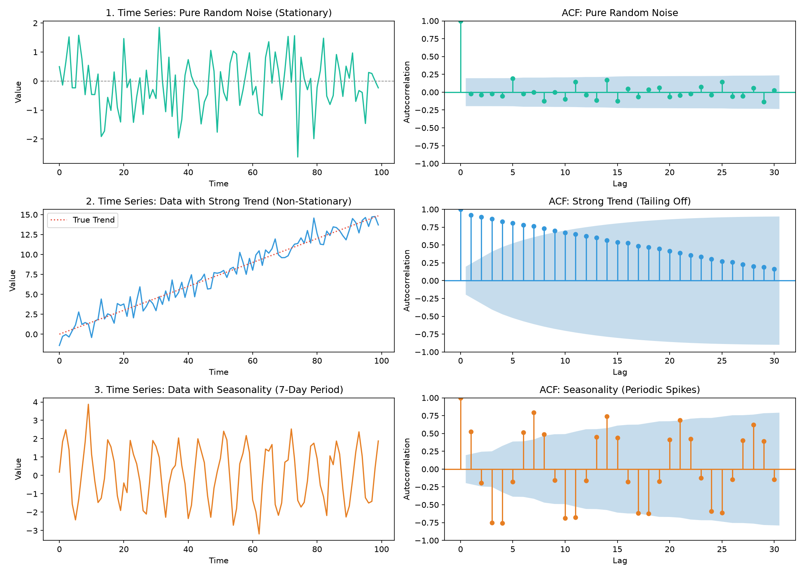

# Autocorrelation Function (ACF)

An Autocorrelation Function (ACF) plot, also known as a **correlogram**, is a visual tool used to measure how a data point in a time series relates to its own past values.

The "auto" in autocorrelation means _self_. Instead of measuring the relationship between two different variables (like studying study hours vs. exam scores), autocorrelation measures the relationship between a variable and a lagged version of itself (like today’s stock price vs. yesterday’s stock price).

---

## The Math: Understanding the Equation

To understand the ACF plot, we have to look at how we calculate the autocorrelation coefficient at a specific lag $k$ (written as $\rho_k$ or $r_k$).

The formula for the autocorrelation of a sample at lag $k$ is:

$$r_k = \frac{\sum_{t=k+1}^{n} (Y_t - \bar{Y})(Y_{t-k} - \bar{Y})}{\sum_{t=1}^{n} (Y_t - \bar{Y})^2}$$

Where:

- $Y_t$ is the value of the series at time $t$.
- $Y_{t-k}$ is the value of the series shifted back by $k$ time steps (the "lagged" value).
- $\bar{Y}$ is the overall mean (average) of the entire time series.
- $n$ is the total number of observations.

### Breaking Down the Components:

- **The Numerator (Autocovariance at Lag $k$)**: It calculates the covariance between the series and its lagged self using the standard cross-multiplication logic (how they move together relative to the mean).
- **The Denominator (Total Variance)**: It is the total sum of squared deviations from the mean (variance of the series). Dividing by the variance scales the result perfectly between $-1$ and $+1$, turning it into a standardized correlation coefficient.

---

## How to Read an ACF Plot: Three Example Scenarios

An ACF plot charts the lag number ($k = 1, 2, 3, \dots$) on the X-axis and the correlation coefficient ($r_k$) on the Y-axis. It also includes a shaded blue region representing the **95% confidence interval** (statistical significance boundary).

> [!NOTE]
> If a vertical bar pushes past this blue zone, the correlation at that lag is statistically significant (highly unlikely to be a random coincidence).

Here are the three most common patterns you will encounter:

### 1. Pure Random Noise (Stationary / White Noise)

If your data is truly random and stationary (like the residuals after you successfully clean a model), what happened yesterday has zero impact on today.

- **What the plot looks like**: Lag 0 will always be exactly $1.0$ (because a number is perfectly correlated with itself). Every single subsequent bar (Lag 1, Lag 2, etc.) will be tiny and sit comfortably inside the blue shaded margin of error.

### 2. Data with a Strong Trend (Non-Stationary)

If your data has a steady upward or downward trend, observations close to each other in time will have very similar values.

- **What the plot looks like**: You will see a distinct "tailing off" geometry. Lag 1 will be massive, Lag 2 slightly smaller, Lag 3 smaller still, forming a slow, gradual downward slope that takes a long time to cross back into the blue zone. This is a dead giveaway that the series is non-stationary and needs to be detrended.

### 3. Data with Seasonality

If your data has a repeating cycle—say, a weekly heartbeat in daily sales data—today's sales will be highly correlated with sales exactly 7 days ago, 14 days ago, and 21 days ago.

- **What the plot looks like**: The bars will form a wave-like pattern. You will see prominent, statistically significant spikes shooting out of the blue zone at regular intervals (e.g., exactly at Lag 7, Lag 14, Lag 21).

---

## The ACF Plot as a Diagnostic Superpower

While the textbook definition of the ACF plot is "measuring autocorrelation," its main practical superpower in the real world is acting as a diagnostic map to spot trends and seasonality before you build a model.

To put it all together, here is a quick reference table of exactly how the ACF plot talks to you:

| What you see on the ACF plot                               | What your data has      | What action you must take                           |
| :--------------------------------------------------------- | :---------------------- | :-------------------------------------------------- |
| **Bars slowly decay like a long, gradual ramp**            | A Trend                 | Detrend your data (e.g., difference it).            |
| **Bars spike rhythmically at regular lag intervals**       | Seasonality             | Deseasonalize your data (or use a seasonal model).  |
| **All bars are tiny and stay inside the blue shaded zone** | Pure Noise (Stationary) | Nothing! Your data is clean and ready for modeling. |

By checking the ACF plot at the beginning, middle, and end of your workflow, you ensure that you successfully strip away all the predictable patterns (trends and seasonality) until you are left with nothing but pure, uncorrelated random error.

> [!TIP]
> While the ACF plot measures total autocorrelation, the **Partial Autocorrelation Function (PACF)** is a complementary tool that strips away indirect correlation. To learn how it works and how to use it for model selection, check out the [Deep Dive: Partial Autocorrelation Function (PACF)](5_pacf.md).

---

## Visual Examples of ACF Plots

