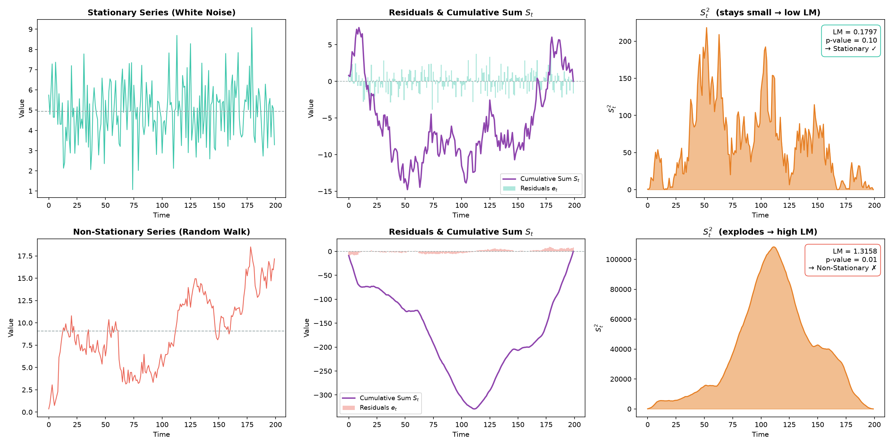

# Stationarity Tests

The KPSS test assumes the time series is composed of three things: a **deterministic trend**, a **random walk**, and a **stationary error term**. It tests whether the variance of that random walk component is zero. If it is zero, the random walk disappears, and the series is stationary.

---

## 1. The Underlying Model

The KPSS test models a time series $y_t$ (for $t = 1, 2, \dots, T$) using the following regression formula:

$$y_t = \xi t + r_t + \varepsilon_t$$

Where:

- $\xi t$ is the **deterministic trend** (a straight line changing over time). If we are testing for level stationarity rather than trend stationarity, we set $\xi = 0$.
- $\varepsilon_t$ is a **stationary error term** (white noise).
- $r_t$ is a **random walk** component, defined as:

$$r_t = r_{t-1} + u_t$$

Here, $u_t$ is an independent and identically distributed (i.i.d.) random error with a mean of $0$ and a variance of $\sigma_u^2$.

---

## 2. The Hypothesis

The trick to the KPSS test lies in the variance of $u_t$ ($\sigma_u^2$).

- If $\sigma_u^2 = 0$, then $r_t$ becomes a constant intercept ($r_0$). The random walk element vanishes, leaving only a stationary series around a fixed level or trend.
- If $\sigma_u^2 > 0$, the random walk persists, meaning the series has a unit root and is **non-stationary**.

Therefore, the hypotheses are structured as:

- **Null Hypothesis ($H_0$)**: $\sigma_u^2 = 0$ (The series is stationary)
- **Alternative Hypothesis ($H_a$)**: $\sigma_u^2 > 0$ (The series is non-stationary)

---

## 3. The Test Statistic Equation

To calculate the test statistic (often denoted as $LM$ for Lagrange Multiplier), we use the following equation:

$$LM = \frac{\sum_{t=1}^{T} S_t^2}{T^2 \hat{\sigma}^2}$$

Let's break down each variable in this equation:

### $S_t$ (The Cumulative Sum of Residuals)

First, you run an ordinary least squares (OLS) regression of $y_t$ on a constant (and a trend, if testing for trend stationarity) to get the residuals, $e_t$.

$S_t$ is the cumulative sum of these residuals from the first time step up to time $t$:

$$S_t = \sum_{i=1}^{t} e_i$$

If the data is stationary, the residuals will fluctuate around zero, causing them to cancel each other out, keeping $S_t^2$ relatively small. If the data is non-stationary, the residuals will drift, making $S_t^2$ grow quite large.

### $T$

The total number of observations in your time series sample.

### $\hat{\sigma}^2$ (The Long-Run Variance)

This is an estimator of the residual variance. Because time series data often has short-term autocorrelation, a simple variance formula isn't enough. The KPSS test uses a "Newey-West" estimator to patch this, which looks like:

$$\hat{\sigma}^2 = \frac{1}{T}\sum_{t=1}^{T} e_t^2 + \frac{2}{T}\sum_{s=1}^{l} w(s, l) \sum_{t=s+1}^{T} e_t e_{t-s}$$

Where $w(s, l)$ is a weighting function (usually a Bartlett window) and $l$ is a chosen lag truncation parameter.

---

## 4. Concrete Example: Step-by-Step KPSS Calculation

To see exactly how all the pieces fit together, let's perform the KPSS test by hand on the same short time series of $T = 5$ observations used in the [ACF](5_acf.md) and [PACF](6_pacf.md) notes:

$$y = [2, 4, 5, 4, 5]$$

For this small example, we will use the **level stationarity** version of the test (no trend term, $\xi = 0$) and set the lag truncation parameter $l = 0$ (i.e., use the simple variance estimator with no autocorrelation correction).

### Step 1: Calculate the Mean ($\bar{y}$)

We regress $y_t$ on a constant. For OLS on a constant, the fitted value is simply the sample mean:

$$\bar{y} = \frac{2 + 4 + 5 + 4 + 5}{5} = \frac{20}{5} = 4$$

### Step 2: Calculate the Residuals ($e_t$)

The residuals are the difference between each observation and the mean:

$$e_t = y_t - \bar{y}$$

| Time ($t$) | $y_t$ | $\bar{y}$ | $e_t = y_t - \bar{y}$ |
| :--------: | :---: | :-------: | :--------------------: |
| 1 | 2 | 4 | $2 - 4 = -2$ |
| 2 | 4 | 4 | $4 - 4 = 0$ |
| 3 | 5 | 4 | $5 - 4 = +1$ |
| 4 | 4 | 4 | $4 - 4 = 0$ |
| 5 | 5 | 4 | $5 - 4 = +1$ |

### Step 3: Calculate the Cumulative Sum ($S_t$)

$S_t$ is the running total of the residuals from the beginning up to time $t$:

$$S_t = \sum_{i=1}^{t} e_i$$

| Time ($t$) | $e_t$ | Cumulative Calculation | $S_t$ |
| :--------: | :---: | :--------------------: | :---: |
| 1 | $-2$ | $-2$ | $-2$ |
| 2 | $0$  | $-2 + 0$ | $-2$ |
| 3 | $+1$ | $-2 + 0 + 1$ | $-1$ |
| 4 | $0$  | $-2 + 0 + 1 + 0$ | $-1$ |
| 5 | $+1$ | $-2 + 0 + 1 + 0 + 1$ | $0$ |

Notice that the cumulative sum starts negative (because of the large $e_1 = -2$) and slowly climbs back to $0$. This is normal for stationary data — the residuals cancel each other out over time.

### Step 4: Square the Cumulative Sums ($S_t^2$) and Sum Them

| Time ($t$) | $S_t$ | $S_t^2$ |
| :--------: | :---: | :-----: |
| 1 | $-2$ | $(-2)^2 = 4$ |
| 2 | $-2$ | $(-2)^2 = 4$ |
| 3 | $-1$ | $(-1)^2 = 1$ |
| 4 | $-1$ | $(-1)^2 = 1$ |
| 5 | $0$ | $(0)^2 = 0$ |
| | | $\sum S_t^2 = \mathbf{10}$ |

### Step 5: Calculate the Long-Run Variance ($\hat{\sigma}^2$)

With lag truncation $l = 0$, the Newey-West estimator simplifies to the standard residual variance:

$$\hat{\sigma}^2 = \frac{1}{T}\sum_{t=1}^{T} e_t^2 = \frac{1}{5} \left[ (-2)^2 + 0^2 + 1^2 + 0^2 + 1^2 \right]$$

$$\hat{\sigma}^2 = \frac{1}{5} [4 + 0 + 1 + 0 + 1] = \frac{6}{5} = 1.2$$

### Step 6: Compute the LM Test Statistic

Plug everything into the formula:

$$LM = \frac{\sum_{t=1}^{T} S_t^2}{T^2 \hat{\sigma}^2} = \frac{10}{5^2 \times 1.2} = \frac{10}{30} = 0.3333$$

### How to Read This Result

Compare the LM statistic ($0.3333$) against the standard KPSS critical values:

| Significance Level | 10% | 5% | 2.5% | 1% |
| :--- | :---: | :---: | :---: | :---: |
| **Critical Value** | $0.347$ | $0.463$ | $0.574$ | $0.739$ |

Our LM statistic of $0.3333$ is **below all critical values** (even the 10% threshold of $0.347$). Therefore, we **fail to reject $H_0$** — the data is stationary.

> [!TIP]
> This makes intuitive sense: the data $[2, 4, 5, 4, 5]$ bounces around a stable mean of $4$ with no visible trend or drift. The cumulative sum $S_t$ stayed modest and returned to zero, keeping $S_t^2$ small and the LM statistic well below the critical threshold.

### Step-by-Step Visualization

The four panels below trace every stage of the calculation, from the raw data through to the final LM statistic:

![KPSS Step-by-Step Calculation for y = [2, 4, 5, 4, 5]](assets/kpss_step_by_step.png)

---

## Summary of the Output

Once the $LM$ statistic is calculated, it is compared against critical asymptotic values:

| Outcome | Condition | Interpretation |
| :------ | :-------- | :------------- |
| **Reject $H_0$** | $LM$ statistic $>$ critical value (p-value $< 0.05$) | The data is **non-stationary** |
| **Fail to reject $H_0$** | $LM$ statistic $<$ critical value (p-value $> 0.05$) | The data is **stationary** |

---

## Concrete Example: Applying the KPSS Test

To see the KPSS test in action, let's apply it to two very different time series—one that is clearly stationary and one that is not—and trace how the math produces the right answer in each case.

### The Two Datasets ($T = 200$)

| Dataset | Description | Expected Result |
| :------ | :---------- | :-------------- |
| **Series A** | White noise centered around a mean of $5$ ($\varepsilon_t \sim N(5, 1.5^2)$) | Stationary |
| **Series B** | A random walk ($y_t = y_{t-1} + u_t$, where $u_t \sim N(0, 1)$) | Non-stationary |

### Step 1: Run the OLS Regression and Get Residuals ($e_t$)

For a level stationarity test, we regress each series on a constant (its own mean $\bar{y}$). The residuals are simply:

$$e_t = y_t - \bar{y}$$

- **Series A** (Stationary): The residuals bounce randomly around zero. They are small and unsystematic because the data genuinely fluctuates around a fixed mean.
- **Series B** (Random Walk): The residuals also center at zero on average, but they exhibit long, sustained drifts away from zero because the underlying data wanders far from its overall mean.

### Step 2: Compute the Cumulative Sum $S_t$

This is the key step. We accumulate the residuals over time:

$$S_t = \sum_{i=1}^{t} e_i = e_1 + e_2 + \dots + e_t$$

- **Series A** (Stationary): Because the residuals are random and cancel each other out, $S_t$ stays small. It wanders near zero like a person shuffling randomly back and forth.
- **Series B** (Random Walk): Because the residuals drift systematically, $S_t$ grows massive. It balloons to values of $-200$ or more, far from zero.

### Step 3: Square and Sum $S_t^2$ to Get the LM Statistic

The test statistic sums up $S_t^2$ across all time points:

$$LM = \frac{\sum_{t=1}^{T} S_t^2}{T^2 \hat{\sigma}^2}$$

- **Series A** (Stationary): Since $S_t$ stayed small, $S_t^2$ stays small → **low $LM$ statistic**.
- **Series B** (Random Walk): Since $S_t$ exploded, $S_t^2$ is enormous → **high $LM$ statistic**.

### Results

| | Series A (White Noise) | Series B (Random Walk) |
| :--- | :--- | :--- |
| **LM Statistic** | $0.1797$ | $1.3158$ |
| **p-value** | $> 0.10$ | $< 0.01$ |
| **Critical Value (5%)** | $0.463$ | $0.463$ |
| **Decision** | Fail to reject $H_0$ → **Stationary ✓** | Reject $H_0$ → **Non-Stationary ✗** |

> [!NOTE]
> For Series A, the LM statistic ($0.1797$) is well below the 5% critical value ($0.463$), so we fail to reject the null hypothesis — the data is stationary. For Series B, the LM statistic ($1.3158$) far exceeds the critical value, so we reject the null — the data is non-stationary.

---

## Visualizing the KPSS Test Mechanics

The figure below shows how the KPSS test works on both series, side by side. From left to right: the raw time series, the OLS residuals with their cumulative sum $S_t$, and the $S_t^2$ values that drive the final LM statistic.

Notice how for the stationary series (top row), $S_t$ wanders gently and $S_t^2$ stays modest. For the random walk (bottom row), $S_t$ drifts massively and $S_t^2$ explodes — this is exactly what pushes the LM statistic above the critical threshold.

---

# Augmented Dickey-Fuller (ADF) Test

The Augmented Dickey-Fuller (ADF) test is a statistical test used to determine whether a time series has a **unit root**, which is a feature that causes a time series to be non-stationary.

Unlike the KPSS test, the ADF test is a **downward test** where the default assumption is that your data is messy and non-stationary.

---

## 1. The Underlying Concept & Model

The ADF test is based on an Autoregressive (AR) model. To test for a unit root, we look at a basic $AR(1)$ model:

$$y_t = \rho y_{t-1} + \varepsilon_t$$

- If $\rho = 1$, the series has a unit root and behaves like a random walk (non-stationary).
- If $|\rho| < 1$, the series is stationary.

To make it easier to test statistically, we subtract $y_{t-1}$ from both sides to work with differences ($\Delta y_t = y_t - y_{t-1}$):

$$\Delta y_t = (\rho - 1)y_{t-1} + \varepsilon_t$$

We rewrite $(\rho - 1)$ as $\gamma$. Now, the hypothesis becomes:

- If $\gamma = 0$, then $\rho = 1$ (Unit root / Non-stationary).
- If $\gamma < 0$, then $\rho < 1$ (Stationary).

The "Augmented" part of the ADF test adds structural lags ($\Delta y_{t-p}$) to account for higher-order serial correlation in the data. The full mathematical regression model looks like this:

$$\Delta y_t = \alpha + \beta t + \gamma y_{t-1} + \delta_1 \Delta y_{t-1} + \delta_2 \Delta y_{t-2} + \dots + \delta_p \Delta y_{t-p} + \varepsilon_t$$

Where:

- $\alpha$ is a constant (drift).
- $\beta t$ is a deterministic time trend.
- $p$ is the number of lagged difference terms included to eliminate autocorrelation in the error term $\varepsilon_t$.

---

## 2. The Hypotheses

- **Null Hypothesis ($H_0$)**: $\gamma = 0$ (The series has a unit root; it is **non-stationary**).
- **Alternative Hypothesis ($H_a$)**: $\gamma < 0$ (The series does not have a unit root; it is **stationary**).

> [!IMPORTANT]
> Notice that the ADF hypotheses are the **opposite** of the KPSS test. In KPSS, the null is "stationary." In ADF, the null is "non-stationary." This is why the two tests are often used together as a cross-check.

---

## 3. Concrete Example: Step-by-Step ADF Calculation

Let's walk through the entire ADF test by hand on a short time series.

### The Dataset ($T = 6$)

$$y = [10, 12, 11, 15, 14, 18]$$

We will use a lag length of $p = 1$ (one lagged difference term) and include a constant ($\alpha$) but no time trend ($\beta = 0$). This gives us the regression:

$$\Delta y_t = \alpha + \gamma y_{t-1} + \delta_1 \Delta y_{t-1} + \varepsilon_t$$

### Step 1: Prepare Your Data and Differences

First, calculate the first differences ($\Delta y_t = y_t - y_{t-1}$):

| $t$ | $y_t$ | $\Delta y_t = y_t - y_{t-1}$ |
| :-: | :---: | :--------------------------: |
| 1 | 10 | — |
| 2 | 12 | $12 - 10 = +2$ |
| 3 | 11 | $11 - 12 = -1$ |
| 4 | 15 | $15 - 11 = +4$ |
| 5 | 14 | $14 - 15 = -1$ |
| 6 | 18 | $18 - 14 = +4$ |

Next, create your lagged variables. With $p = 1$, we need $y_{t-1}$ (the lagged level) and $\Delta y_{t-1}$ (the lagged difference):

| $t$ | $y_t$ | $\Delta y_t$ (Dependent) | $y_{t-1}$ (Regressor) | $\Delta y_{t-1}$ (Regressor) |
| :-: | :---: | :----------------------: | :-------------------: | :--------------------------: |
| 1 | 10 | — | — | — |
| 2 | 12 | $+2$ | 10 | — |
| 3 | 11 | $-1$ | 12 | $+2$ |
| 4 | 15 | $+4$ | 11 | $-1$ |
| 5 | 14 | $-1$ | 15 | $+4$ |
| 6 | 18 | $+4$ | 14 | $-1$ |

> [!NOTE]
> Because of the lags, our usable regression matrix shrinks to rows $t = 3, 4, 5, 6$ (4 observations).

### Step 2: Estimate the Regression Coefficients via OLS

Run an Ordinary Least Squares (OLS) linear regression on the usable rows:

$$\Delta y_t = \alpha + \gamma y_{t-1} + \delta_1 \Delta y_{t-1}$$

Using matrix algebra $\hat{B} = (X^T X)^{-1} X^T Y$, we set up:

$$Y = \begin{bmatrix} -1 \\ 4 \\ -1 \\ 4 \end{bmatrix}, \quad X = \begin{bmatrix} 1 & 12 & 2 \\ 1 & 11 & -1 \\ 1 & 15 & 4 \\ 1 & 14 & -1 \end{bmatrix}$$

Solving the OLS system gives us the estimated coefficients:

| Coefficient | Symbol | Estimate |
| :---------- | :----: | :------: |
| Intercept | $\hat{\alpha}$ | $-2.20$ |
| Lagged level | $\hat{\gamma}$ | $+0.3817$ |
| Lagged difference | $\hat{\delta}_1$ | $-1.26$ |

### Step 3: Calculate the Standard Error of $\hat{\gamma}$

To know if $\hat{\gamma}$ is statistically significant, we must compute its standard error, $SE(\hat{\gamma})$:

1. **Calculate the residuals**: $e_t = \Delta y_t - \hat{\Delta y}_t$

| $t$ | Actual $\Delta y_t$ | Fitted $\hat{\Delta y}_t$ | Residual $e_t$ |
| :-: | :------------------: | :-----------------------: | :------------: |
| 3 | $-1$ | $-0.14$ | $-0.86$ |
| 4 | $+4$ | $+3.26$ | $+0.74$ |
| 5 | $-1$ | $-1.52$ | $+0.52$ |
| 6 | $+4$ | $+4.40$ | $-0.40$ |

2. **Residual variance**: $s^2 = \frac{\sum e_t^2}{N - k} = \frac{(-0.86)^2 + (0.74)^2 + (0.52)^2 + (-0.40)^2}{4 - 3} = \frac{1.72}{1} = 1.72$

   Where $N = 4$ (usable observations) and $k = 3$ (parameters: $\alpha$, $\gamma$, $\delta_1$).

3. **Standard error**: $SE(\hat{\gamma})$ is the square root of the diagonal element corresponding to $y_{t-1}$ in the variance-covariance matrix $s^2 (X^T X)^{-1}$:

$$SE(\hat{\gamma}) = 0.4858$$

### Step 4: Compute the ADF Test Statistic

The test statistic is a $t$-statistic for the $\hat{\gamma}$ coefficient:

$$t_{ADF} = \frac{\hat{\gamma}}{SE(\hat{\gamma})} = \frac{0.3817}{0.4858} = +0.79$$

### Step 5: Compare Against Dickey-Fuller Critical Values

Because this test involves non-stationary data under the null, the standard Student's $t$-distribution cannot be used. Instead, we compare against Dickey-Fuller critical values:

| Significance Level | 1% | 5% | 10% |
| :--- | :---: | :---: | :---: |
| **Critical Value** (constant, no trend) | $-3.75$ | $-3.00$ | $-2.63$ |

Our $t_{ADF} = +0.79$ is **far to the right** of all critical values (not even negative). Therefore, we **fail to reject $H_0$** — the data is non-stationary.

> [!TIP]
> This makes intuitive sense: the data $[10, 12, 11, 15, 14, 18]$ has a clear upward trend, drifting from $10$ to $18$. The positive $\hat{\gamma}$ means the series is actually *diverging* rather than reverting to a mean. To reject $H_0$ and declare stationarity, $t_{ADF}$ would need to be a large negative number (more negative than the critical value), indicating that $\gamma < 0$ and the series is pulled back toward its mean.

### Step-by-Step Visualization

The four panels below trace the ADF calculation from the raw data through to the critical value comparison:

![ADF Step-by-Step Calculation for y = [10, 12, 11, 15, 14, 18]](assets/adf_step_by_step.png)

---

## Summary: KPSS vs. ADF at a Glance

| | **KPSS Test** | **ADF Test** |
| :--- | :--- | :--- |
| **Null Hypothesis** | Series is **stationary** | Series is **non-stationary** (unit root) |
| **Alternative** | Series is non-stationary | Series is stationary |
| **Test Direction** | Reject $H_0$ if statistic is **too large** | Reject $H_0$ if statistic is **too negative** |
| **What it tests** | Variance of random walk component = 0 | Coefficient $\gamma = 0$ (unit root) |
| **Key formula** | $LM = \frac{\sum S_t^2}{T^2 \hat{\sigma}^2}$ | $t_{ADF} = \frac{\hat{\gamma}}{SE(\hat{\gamma})}$ |
| **Best practice** | Use **both** together as a cross-check | Use **both** together as a cross-check |

> [!IMPORTANT]
> In practice, you should run **both** the KPSS and ADF tests on your data. If they agree (e.g., ADF rejects non-stationarity AND KPSS fails to reject stationarity), you have strong evidence. If they disagree, your data may be borderline and needs further investigation (e.g., differencing or a longer sample).
