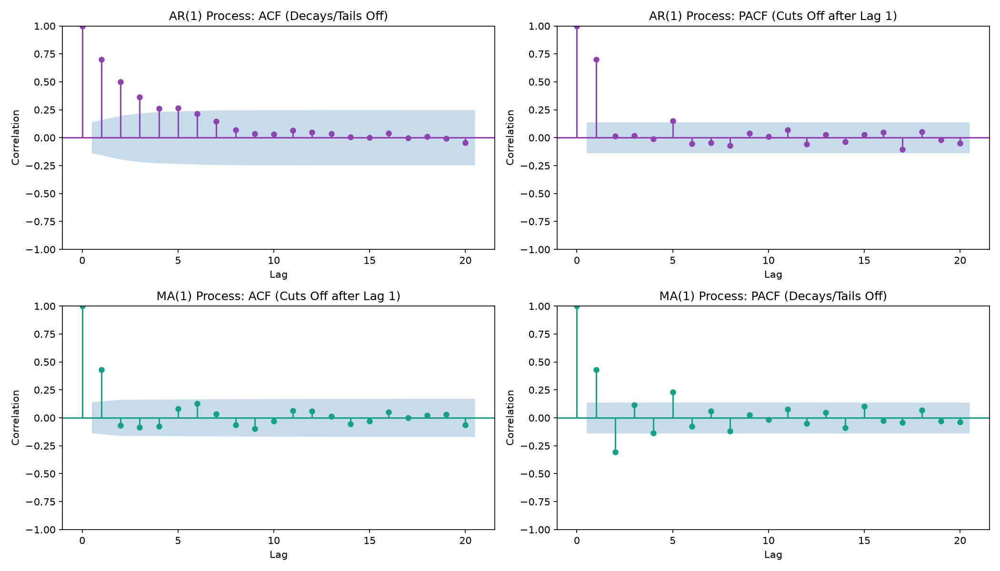

# Partial Autocorrelation Function (PACF)

While the Autocorrelation Function (ACF) measures the total correlation between a data point $Y_t$ and its past value $Y_{t-k}$, it doesn't tell the whole story. Much of that correlation is often "inherited" through intermediate steps.

The **Partial Autocorrelation Function (PACF)** solves this by measuring the **direct correlation** between $Y_t$ and $Y_{t-k}$ after removing the linear effects of all intermediate lags ($Y_{t-1}, Y_{t-2}, \dots, Y_{t-k+1}$).

---

## The Concept: Removing the "Middlemen"

Imagine the temperature on three consecutive days: Monday ($Y_{t-2}$), Tuesday ($Y_{t-1}$), and Wednesday ($Y_t$).

- Monday's temperature affects Tuesday's temperature.
- Tuesday's temperature affects Wednesday's temperature.
- Because of this chain reaction, Monday's temperature is correlated with Wednesday's temperature.

If you run an **ACF** plot, it will show a strong correlation between Wednesday ($Y_t$) and Monday ($Y_{t-2}$). However, this is mostly an **indirect correlation** passed through the middleman, Tuesday ($Y_{t-1}$).

If you run a **PACF** plot, it strips away Tuesday's influence, measuring only the pure, direct relationship between Monday and Wednesday. If Monday has no unique information to offer Wednesday beyond what Tuesday already carries, the partial autocorrelation at lag 2 will be exactly **zero**.

---

## The Math: Two Ways to Define PACF

Mathematically, the partial autocorrelation coefficient at lag $k$ (written as $\phi_{kk}$ or $\alpha_k$) can be defined in two ways.

### Method 1: The Autoregressive Coefficient

The most common way to define the partial autocorrelation $\phi_{kk}$ at lag $k$ is as the last coefficient in a linear regression of $Y_t$ on its first $k$ lags:

$$Y_t = \phi_{k1} Y_{t-1} + \phi_{k2} Y_{t-2} + \dots + \phi_{kk} Y_{t-k} + \varepsilon_t$$

Where:

- $\phi_{ki}$ is the $i$-th coefficient in an autoregressive model of order $k$.
- $\phi_{kk}$ is the coefficient of the oldest lag ($Y_{t-k}$), which represents the partial autocorrelation at lag $k$.
- $\varepsilon_t$ is the residual error.

By including the intermediate lags ($Y_{t-1}, \dots, Y_{t-k+1}$) in the regression model, we control for their influence. The coefficient $\phi_{kk}$ measures the remaining correlation that is uniquely attributable to $Y_{t-k}$.

### Method 2: Residual Correlation

Another way to calculate $\phi_{kk}$ is by finding the correlation between the residuals of two separate linear regressions:

1. Regress $Y_t$ on the intermediate lags to find what part of $Y_t$ cannot be explained by the intermediates:
   $$\hat{Y}_t = \beta_1 Y_{t-1} + \beta_2 Y_{t-2} + \dots + \beta_{k-1} Y_{t-k+1}$$
   $$u_t = Y_t - \hat{Y}_t$$

2. Regress $Y_{t-k}$ on the same intermediate lags to find what part of the oldest lag cannot be explained by the intermediates:
   $$\hat{Y}_{t-k} = \gamma_1 Y_{t-1} + \gamma_2 Y_{t-2} + \dots + \gamma_{k-1} Y_{t-k+1}$$
   $$v_{t-k} = Y_{t-k} - \hat{Y}_{t-k}$$

3. Calculate the partial autocorrelation as the simple Pearson correlation coefficient of these two residuals:
   $$\phi_{kk} = \text{Corr}(u_t, v_{t-k})$$

---

## How PACF is Used in the Real World

In time series modeling (specifically the **Box-Jenkins methodology** for ARIMA modeling), the combination of ACF and PACF plots is the primary tool used to determine the order of Autoregressive ($AR$) and Moving Average ($MA$) components.

### 1. Identifying Autoregressive $AR(p)$ Models

An Autoregressive process of order $p$, written as $AR(p)$, is modeled as:
$$Y_t = c + \phi_1 Y_{t-1} + \phi_2 Y_{t-2} + \dots + \phi_p Y_{t-p} + \varepsilon_t$$

- **ACF Behavior**: Tails off gradually (exponentially decaying or sinusoidal wave), because a shock at time $t$ propagates infinitely through the autoregressive chain.
- **PACF Behavior**: **Cuts off** abruptly after lag $p$. Since the true model only relies on lags up to $p$, any lag greater than $p$ has zero direct correlation with $Y_t$ once the intermediate lags are controlled.
- **Rule of Thumb**: If the PACF shows $p$ significant spikes before dropping inside the 95% confidence interval, you should fit an **$AR(p)$** model.

### 2. Identifying Moving Average $MA(q)$ Models

A Moving Average process of order $q$, written as $MA(q)$, is modeled as:
$$Y_t = c + \varepsilon_t + \theta_1 \varepsilon_{t-1} + \theta_2 \varepsilon_{t-2} + \dots + \theta_q \varepsilon_{t-q}$$

- **ACF Behavior**: **Cuts off** abruptly after lag $q$. Since the series is only driven by the last $q$ shocks, observations separated by more than $q$ lags share zero common shocks.
- **PACF Behavior**: Tails off gradually (exponentially decaying or sinusoidal wave) instead of cutting off. This happens because the moving average shocks are back-calculated recursively, creating an infinite-memory autoregressive representation.
- **Rule of Thumb**: If the ACF cuts off after lag $q$ and the PACF decays slowly, you should fit an **$MA(q)$** model.

---

## Quick Diagnostic Reference Table

| Model            | ACF Plot                            | PACF Plot                           |
| :--------------- | :---------------------------------- | :---------------------------------- |
| **$AR(p)$**      | Decays / Tails off gradually        | **Cuts off abruptly after lag $p$** |
| **$MA(q)$**      | **Cuts off abruptly after lag $q$** | Decays / Tails off gradually        |
| **$ARMA(p, q)$** | Decays / Tails off gradually        | Decays / Tails off gradually        |

---

## Visual Comparison: AR(1) vs. MA(1)

Below is a visual example generated using simulated time series data. Notice how the behaviors of the ACF and PACF plots swap between the Autoregressive ($AR$) and Moving Average ($MA$) processes:

