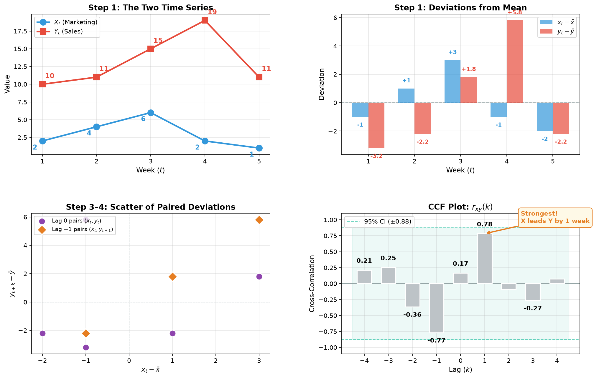

# Comparing Time Series

The Cross-Correlation Function (CCF) is used to identify the linear relationship between two **different** time series, $X_t$ and $Y_t$, mapped across various time lags ($k$).

Here is the mathematical breakdown and a step-by-step calculation using manual example data.

---

## 1. The Mathematical Equations

To find the cross-correlation, we first need the **cross-covariance**, which measures how much the two variables change together at a given lag $k$.

### The Cross-Covariance Equation ($c_{xy}(k)$)

For a sample of size $T$, the cross-covariance at lag $k$ is calculated as:

**For positive lags ($k \ge 0$):**

$$c_{xy}(k) = \frac{1}{T} \sum_{t=1}^{T-k} (x_t - \bar{x})(y_{t+k} - \bar{y})$$

**For negative lags ($k < 0$):**

$$c_{xy}(k) = \frac{1}{T} \sum_{t=-k+1}^{T} (x_t - \bar{x})(y_{t+k} - \bar{y})$$

(Where $\bar{x}$ and $\bar{y}$ are the sample means of the entire $X$ and $Y$ series, respectively.)

### The Cross-Correlation Equation ($r_{xy}(k)$)

To make this value interpretable (bounding it between $-1$ and $1$), we standardize the cross-covariance by dividing it by the product of the standard deviations (or the square root of the variances at lag 0):

$$r_{xy}(k) = \frac{c_{xy}(k)}{\sqrt{c_{xx}(0) \cdot c_{yy}(0)}}$$

Where $c_{xx}(0)$ and $c_{yy}(0)$ are the sample variances of $X$ and $Y$ at lag 0:

$$c_{xx}(0) = \frac{1}{T} \sum_{t=1}^{T} (x_t - \bar{x})^2, \quad c_{yy}(0) = \frac{1}{T} \sum_{t=1}^{T} (y_t - \bar{y})^2$$

---

## 2. Step-by-Step Calculation Example

Let's say we have a tiny dataset tracking weekly **marketing spend** ($X$) vs. **product sales** ($Y$) over $T = 5$ weeks.

### Step 1: Establish the Data & Means

$$X = [2, 4, 6, 2, 1]$$

$$Y = [10, 11, 15, 19, 11]$$

First, calculate the sample means ($\bar{x}$ and $\bar{y}$):

$$\bar{x} = \frac{2+4+6+2+1}{5} = 3.0$$

$$\bar{y} = \frac{10+11+15+19+11}{5} = 13.2$$

Next, calculate the deviations from the mean for every time step:

| Week ($t$) | $x_t$ | $y_t$ | $x_t - \bar{x}$ | $y_t - \bar{y}$ |
| :--------: | :---: | :---: | :--------------: | :--------------: |
| 1 | 2 | 10 | $-1$ | $-3.2$ |
| 2 | 4 | 11 | $+1$ | $-2.2$ |
| 3 | 6 | 15 | $+3$ | $+1.8$ |
| 4 | 2 | 19 | $-1$ | $+5.8$ |
| 5 | 1 | 11 | $-2$ | $-2.2$ |

### Step 2: Calculate the Base Variances ($c_{xx}(0)$ and $c_{yy}(0)$)

We need the denominators for our final correlation calculation.

$$c_{xx}(0) = \frac{(-1)^2 + (1)^2 + (3)^2 + (-1)^2 + (-2)^2}{5} = \frac{1 + 1 + 9 + 1 + 4}{5} = \frac{16}{5} = 3.2$$

$$c_{yy}(0) = \frac{(-3.2)^2 + (-2.2)^2 + (1.8)^2 + (5.8)^2 + (-2.2)^2}{5} = \frac{10.24 + 4.84 + 3.24 + 33.64 + 4.84}{5} = \frac{56.8}{5} = 11.36$$

The denominator square root multiplier is:

$$\sqrt{c_{xx}(0) \cdot c_{yy}(0)} = \sqrt{3.2 \times 11.36} = \sqrt{36.352} \approx 6.029$$

### Step 3: Calculate Cross-Correlation at Lag 0 ($r_{xy}(0)$)

At lag 0, we match the timestamps perfectly.

$$c_{xy}(0) = \frac{1}{5} \sum_{t=1}^{5} (x_t - \bar{x})(y_t - \bar{y})$$

| Week ($t$) | $x_t - \bar{x}$ | $y_t - \bar{y}$ | Product |
| :--------: | :--------------: | :--------------: | :-----: |
| 1 | $-1$ | $-3.2$ | $(-1)(-3.2) = 3.2$ |
| 2 | $+1$ | $-2.2$ | $(1)(-2.2) = -2.2$ |
| 3 | $+3$ | $+1.8$ | $(3)(1.8) = 5.4$ |
| 4 | $-1$ | $+5.8$ | $(-1)(5.8) = -5.8$ |
| 5 | $-2$ | $-2.2$ | $(-2)(-2.2) = 4.4$ |

$$c_{xy}(0) = \frac{1}{5} [3.2 - 2.2 + 5.4 - 5.8 + 4.4] = \frac{5}{5} = 1.0$$

Now find the correlation $r_{xy}(0)$:

$$r_{xy}(0) = \frac{1.0}{6.029} \approx \mathbf{0.166}$$

### Step 4: Calculate Cross-Correlation at Lag +1 ($r_{xy}(1)$)

Now we shift $Y$ forward by 1 time step. We are testing if **$X$ today predicts $Y$ tomorrow**. Because of the shift, our summation length drops to $T - 1 = 4$.

$$c_{xy}(1) = \frac{1}{5} \sum_{t=1}^{4} (x_t - \bar{x})(y_{t+1} - \bar{y})$$

| Pair | $x_t - \bar{x}$ | $y_{t+1} - \bar{y}$ | Product |
| :--: | :--------------: | :------------------: | :-----: |
| $t=1$ | $-1$ | $y_2 - \bar{y} = -2.2$ | $(-1)(-2.2) = 2.2$ |
| $t=2$ | $+1$ | $y_3 - \bar{y} = +1.8$ | $(1)(1.8) = 1.8$ |
| $t=3$ | $+3$ | $y_4 - \bar{y} = +5.8$ | $(3)(5.8) = 17.4$ |
| $t=4$ | $-1$ | $y_5 - \bar{y} = -2.2$ | $(-1)(-2.2) = 2.2$ |

$$c_{xy}(1) = \frac{1}{5} [2.2 + 1.8 + 17.4 + 2.2] = \frac{23.6}{5} = 4.72$$

Now find the correlation $r_{xy}(1)$:

$$r_{xy}(1) = \frac{4.72}{6.029} \approx \mathbf{0.783}$$

### Step-by-Step Visualization

The four panels below trace the entire CCF calculation from the raw time series through to the final correlogram:

---

## 3. Interpreting the Results

If we look at our calculated coefficients:

| Lag | $r_{xy}(k)$ | Interpretation |
| :-: | :----------: | :------------- |
| $0$ | $0.166$ | **Weak** — Marketing and sales are barely correlated in the same week |
| $+1$ | $0.783$ | **Very strong** — Marketing spend this week strongly predicts sales **next** week |

**Conclusion**: Marketing spend ($X$) does not immediately impact sales ($Y$) in the same week. Instead, it acts as a **leading indicator**, heavily driving up sales exactly one week later ($Lag = +1$).

> [!TIP]
> If you look closely at the original numbers, the spike of $6$ in marketing at week 3 perfectly aligns with the massive spike of $19$ in sales at week 4!
